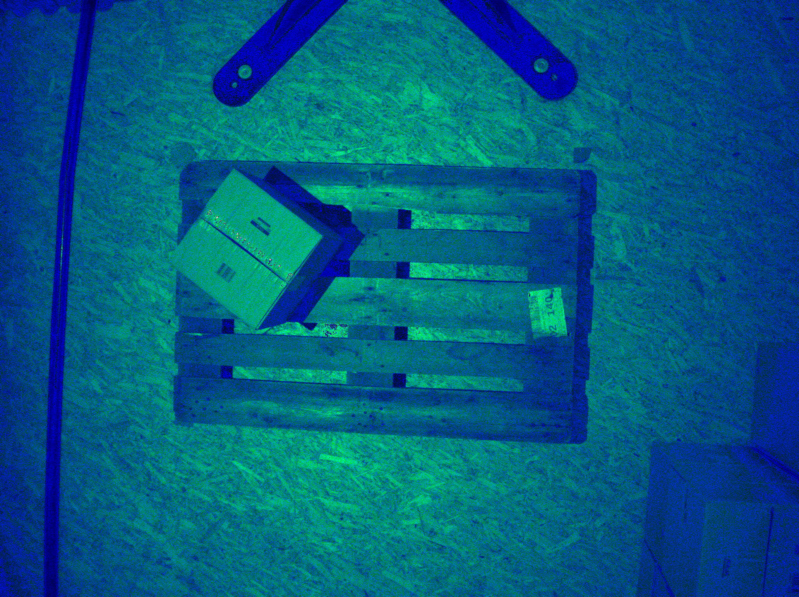
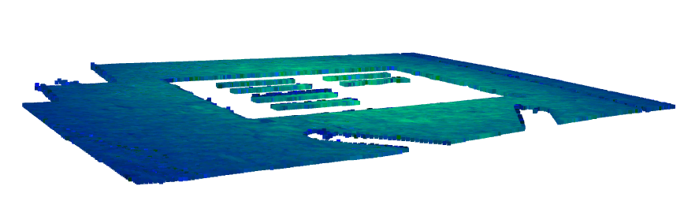
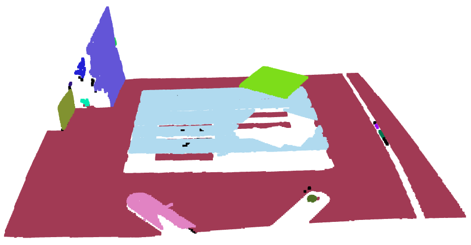
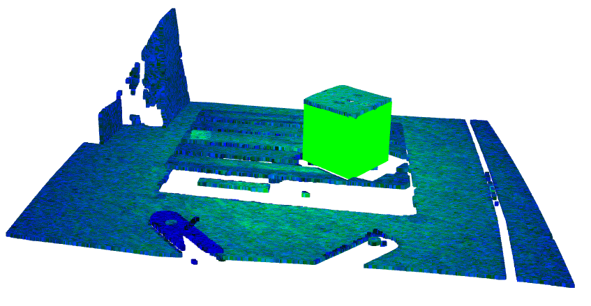

# Setup
Create and activate conda environment:
```bash
conda env create -f environment.yml
conda activate pose_from_depth_map
```

You may download the example data, using the 'download_data.sh' script.

# Goal
Our goal is to estimate the 3D pose of a box in the given data. We will create a 3D bounding box at the estimated pose for visualization.

# Assumptions
This script will only work if the following assumptions hold true.
1. We are given a depth map from a camera looking onto a box from above. Only the top surface of the box is seen by the camera.
2. The box has a surface with its normal pointing towards the camera.
3. Among all planes that can be found in the depth map, the box surface from the second assumption is the closest surface with its normal pointing towards the camera, and the surface the box is standing on is the second closest surface with its normal pointing towards the camera.

# Approach and Results
The 'main.py' script proceedes as follows:
1. The data is loaded.
2. We assume that the given color map is encoded in RGB444 format. This does not seem to be true, but the resulting image looks acceptable and it is only required for visualization purposes.<br>

3. Using the depth map, and the camera intrinsics and extrinsics, we create a point cloud of the environment, by projecting image coordinates into 3D. The resulting point cloud is saved as 'full_point_cloud.ply'. We can visualize it with Open3D:<br>

4. Now, for robustness and faster processing, we downsample the point cloud and remove outlier points.
5. Subsequently, we identify as ground plane as the largest plane in the data:<br>

6. We find clusters in the remaining point cloud, without the ground plane. This allows to separate objects on the ground from the ground itself.
7. Then, to have the entire point cloud again, we re-integrate the ground plane as another cluster. For visualization, each cluster is given a random color:<br>

8. Now, according to our assumptions, we find the closest and second closest surface with its normal pointing towards the camera.
9. Assuming the closest surface representing the top of the box, we fit a bounding box around the corresponding points.
10. The height of the box is estimated as the distance between the closest an second closest surface with its normal pointing towards the camera.
11. The resulting 4x4 transformation matrix of the box is:<br>
 [[   0.79   -0.62   -0.01 -325.95]<br>
 [  -0.62   -0.79   -0.   1112.42]<br>
 [  -0.01    0.01   -1.   1724.32]<br>
 [   0.      0.      0.      1.  ]]
 12. We visualize the estimated bounding box within the full point cloud of the environment in green:<br>


